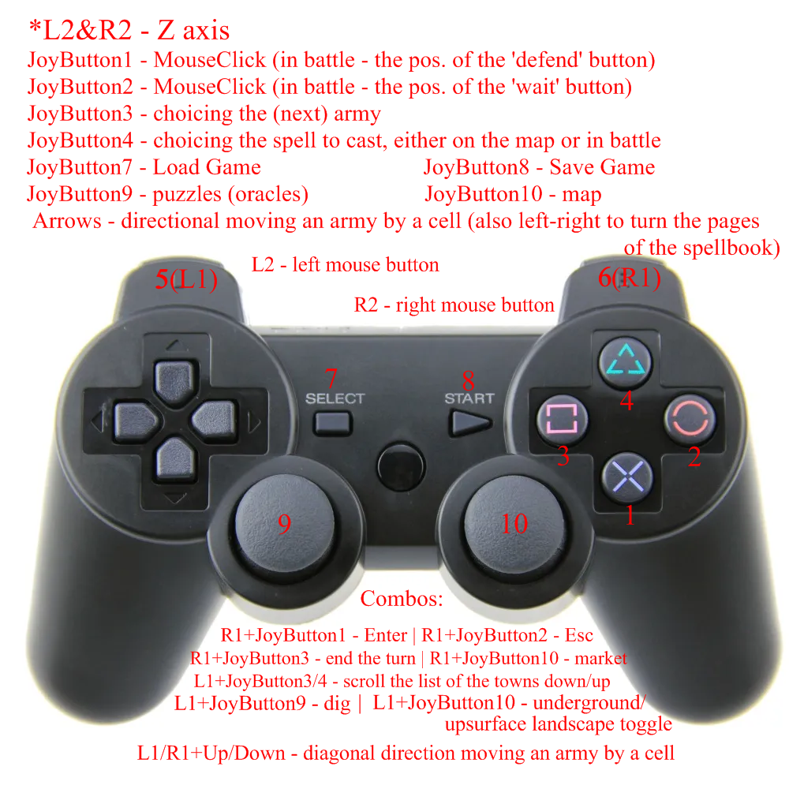

# Heroes of Might and Magic IV

An AHK script for playing HoMMIV game with a gamepad.

Left analog stick - moving gameworld screen

Right analog stick - uses as mouse

Remapped buttons are looking like these:

As I suppose, things must be obvious.

---

Скрипт для AutoHotKey для игры Герои Меча и Магии 4 на джойстике.

Левый аналог двигает игровой мир

Правый аналог используется как мышка

Управление согласно описанному на картинке выше, должно быть понятно.