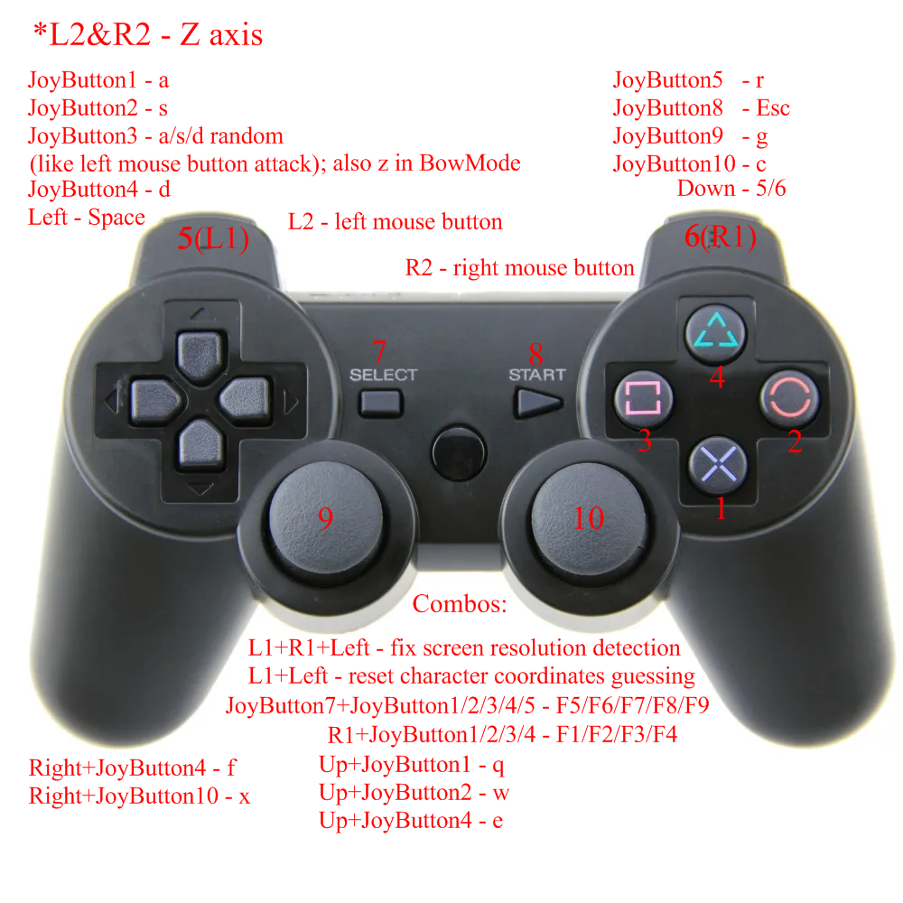

# Revenant (1999)

An AHK script for playing Revenant game with a gamepad.

Left analog stick - rounds mouse cursor around the character

Right analog stick - uses as mouse

Both analog sticks - dodging to the appropriate direction of the right analog stick

Remapped buttons are looking like these:

L1+R1+Left keycombo - sometimes WinGetPos function provides the wrong screen resolution as the desktop's, which leads to the completely wrong cursor center coordinates for the left analog stick rounding logic. Hit this keycombo in-game to re-calculate it.

L1+Left keycombo - there often will be the times (mostly after skipping dialogs on the "Left" button, or loading gamesave) when the cursor center coordinates for the left analog stick rounding logic is out of sync of it's right location relating to the side panel/panels on-screen presence. For fixing it, make the screen clean from the side panel/panels (using the "Left" button perhaps) and hit this keycombo to re-sync the logic (again. And again...)

Right+JoyButton10 - BowMode (when you'll find it ;p). While you are in the bow mode state, hitting the JoyButton3 will send the 'z' key (for shooting an arrow). Hold JoyButton3, and while doing that, aim by using left-right sides of the left analog stick. Hitting JoyButton10 while BowMode will deny the BowMode. AND! Keep in mind that loading gamesave will NOT reset BowMode variable in the script. It's a bit nasty, so train a lil bit before the battle to have an exp about how it works.

As for the rest, as I suppose, things must be obvious. Also, see the comments inside the _JoytoMouse.ahk_ script file itself.

**!!!Important note!!!** edit revenant.ini file - remove all the JOY# (and obviously the comma before each one).

_JoytoMouse_rus.ahk_ is the same script, it just have the comments in Russian.

---

Скрипт для AutoHotKey для игры Revenant на джойстике.

Вращение на левый аналог вращает курсор относительно персонажа на определённом расстоянии

Правый аналог используется как мышка

"Тычок" правого аналога во время наклона левого - кувырок уклонения в соответствующую наклону правого аналога сторону

L1+R1+Влево - бывает при запуске скрипта функция WinGetPos выдаёт значения (ширины и высоты) разрешения экрана ошибочно согласно разрешению рабочего стола, а не игровому, что приводит к тому, что логическое положение центра курсора для левого аналога определяется "ну вообще не там". Жмите эту комбинацию кнопок в момент, когда вы находитесь на экране игры, значения разрешения пересчитаются.

L1+Влево - будут такие ситуации, как, например, пропуская диалоги на кнопку "Влево", или загрузка сейва после смерти, когда логическое положение центра курсора для левого аналога рассинхронизовывается с его правильным положением относительно наличия/отсутствия на игровом экране боковой или боковой+нижней панелей. Чтобы это исправлять, делайте экран без панелей (не без помощи кнопки "Влево") и жмите эту комбинацию кнопок. И так каждый раз как будет сбиваться...

Вправо+кнопка_правого_аналога - BowMode ака режим лука (это когда его найдёте ;p). Когда вы в состоянии режима лука, стрелу выпускать на JoyButton3 (это будет равносильно нажатию кнопки 'z' на клавиатуре). Зажав JoyButton3, вы сможете на стороны лево-право левого аналога наводиться в какую сторону пустить стрелу. Нажатие кнопки правого аналога при режиме лука отменит этот режим (и перс возьмёт меч). А ТАКЖЕ! Имейте в виду, что при загрузке сейва после смерти НЕ СБРАСЫВАЕТСЯ соответствующая BowMode переменная скрипта. Вот, рассуждая со стороны загрузок сейвов, реализация с луком немного кривоватая, так что потренеруйтесь в управлении перед ТОЙ битвой, наловчитесь как оно работает.

Остальное, полагаю, должно быть понятно (см. картинку выше). Можете также почитать комментарии внутри самого скриптового файла.

**!!!Важно!!!** отредактируйте файл revenant.ini - сотрите в нём все JOY# (конечно же, с запятыми перед ними)

_JoytoMouse_rus.ahk_ такой же скрипт как и не-rus, просто в нём комментарии на русском.
